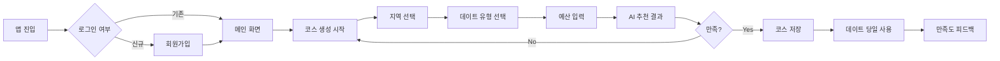
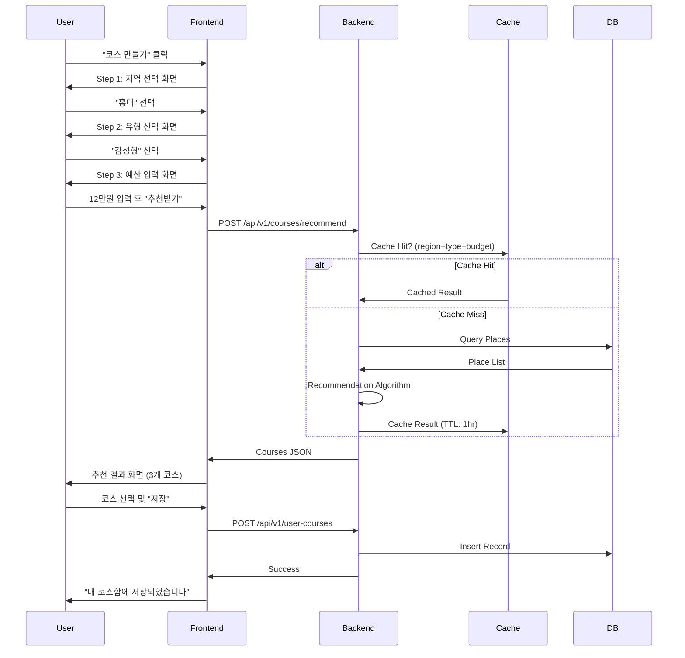

# 📋 PRD: 데이트 딸깍 (Date Ddalkak) MVP v1.0

**Document Owner**: Product Manager  
**Last Updated**: 2026-02-08  
**Status**: Draft → Review  
**Target Launch**: 2026-05-01 (12주 개발 주기)

---

## 1. Executive Summary

### 1.1 Product Vision
**"3분 만에 완성하는 검증된 데이트 코스"**

Z세대 커플들이 겪는 데이트 계획의 피로도(정보 과부하, 시간 부족, 실패 두려움)를 해결하기 위해, 지역/유형/예산 3가지 입력만으로 AI가 동선 최적화된 데이트 코스를 추천하는 서비스.

### 1.2 Business Objectives
- **Primary**: MVP 출시 후 3개월 내 MAU 10,000명 달성
- **Secondary**: D30 Retention 30% 이상, NPS +30 이상 달성
- **Long-term**: 데이트 계획 = 데이트 딸깍이라는 브랜드 인지도 확립

### 1.3 Success Criteria
| 지표 | 목표값 | 측정 시점 |
|---|---|---|
| 가입 → 첫 코스 생성 전환율 | 60% | 출시 후 매주 |
| D7 / D30 Retention | 45% / 30% | 출시 후 1개월 |
| Post-Date Satisfaction | 4.2/5.0 | 지속적 |
| 코스 실행 완료율 | 55% | 지속적 |

---

## 2. Problem Statement

### 2.1 User Pain Points
**Target**: 20~29세 연애 중인 Z세대 (연 500만명 추정)

| 페르소나 | 핵심 Pain Point |
|---|---|
| **계획 스트레스 민준** (24세 개발자) | • 블로그 리서치에 2~3시간 소요<br>• "여기 별로네"라는 말이 트라우마<br>• 예산 오버로 인한 부담 |
| **효율 최고 지우** (27세 마케터) | • 평일 야근으로 리서치 시간 없음<br>• 트렌디한 곳을 찾고 싶지만 방법 모름<br>• 항상 비슷한 곳만 가는 루틴화 |

### 2.2 Market Gap
- 기존 솔루션의 한계:
  - **네이버/구글 검색**: 정보 과부하, 의사결정 피로
  - **인스타그램 맛집 계정**: 광고성 콘텐츠 많음, 동선 고려 없음
  - **커플 앱 (비트윈 등)**: 기록 기능만 있고 추천 없음

---

## 3. Target Users

### 3.1 Primary Users
- **나이**: 22~29세
- **관계 상태**: 연애 중 (3개월 ~ 2년 차)
- **거주지**: 수도권 (서울/경기)
- **데이트 빈도**: 주 1~2회
- **예산**: 1회 데이트 5만원 ~ 20만원

### 3.2 User Personas
자세한 내용은 [페르소나 문서](링크) 참조

---

## 4. User Stories & Use Cases

### 4.1 Core User Journey



### 4.2 User Stories (MoSCoW)

#### Must Have (MVP 필수)
```
US-001: 빠른 코스 생성
As a 데이트 계획이 막막한 사용자
I want to 지역/유형/예산만 입력하면
So that 3분 안에 완성된 코스를 받을 수 있다

AC (Acceptance Criteria):
- [ ] 입력 화면에서 결과까지 평균 3분 이내
- [ ] 모든 필드는 드롭다운 또는 슬라이더로 쉽게 선택
- [ ] 입력 중 실시간 미리보기 제공 (예산 범위 내 장소 개수)
- [ ] **로그인 없이 완전 사용 가능**
```

```
US-002: 검증된 코스 추천
As a 실패가 두려운 사용자
I want to 다른 커플들이 만족한 코스를
So that 안심하고 데이트를 갈 수 있다

AC:
- [ ] 각 코스에 "선택률 상위 X%" 뱃지 표시
- [ ] 최소 3개 이상의 코스 옵션 제공
- [ ] 각 장소마다 평점/리뷰 요약 표시
```

```
US-003: 예산 관리
As a 예산 오버가 걱정되는 사용자
I want to 입력한 예산 내에서만 추천받고
So that 계획대로 지출할 수 있다

AC:
- [ ] 예산 입력 시 ±10% 범위 표시
- [ ] 코스 총 예상 비용 명확히 표시
- [ ] 비용 항목별 상세 (식사 5만원, 카페 1.5만원 등)
```

#### Should Have (초기 출시 후 1개월 이내)
```
US-004: 코스 저장 및 관리
- 마음에 드는 코스를 "내 코스"에 저장
- 과거 사용한 코스 히스토리 조회
- 코스 공유 (카톡, 인스타 스토리)
```

```
US-005: 실시간 피드백
- 데이트 당일 "지금 사용 중" 체크인
- 각 장소별 만족도 별도 평가
- 문제 신고 (폐업, 가격 변경 등)
```

#### Could Have (PMF 달성 후)
```
US-006: 소셜 기능
- 친구 코스 참고하기
- 인기 코스 랭킹
- 커플 프로필 커스터마이징
```

#### Won't Have (MVP 범위 외)
- AI 챗봇 대화형 추천
- 실시간 예약 시스템
- 커플 일정 캘린더 통합
- 영상 콘텐츠 추천

---

## 5. Features & Requirements

### 5.1 Feature List

| Feature ID | Feature Name | Priority | 로그인 | Description |
|---|---|---|---|---|
| F-001 | 카카오톡 간편 로그인 | Must | - | 선택사항 (개인화 기능용) |
| F-002 | 코스 생성 마법사 | Must | ✗ | 3단계 입력 폼 (지역→유형→예산) |
| F-003 | AI 코스 추천 | Must | ✗ | Rule-based 추천 엔진 |
| F-004 | 코스 상세 보기 | Must | ✗ | 장소 정보, 지도, 동선 |
| F-005 | 코스 저장 | Should | ✓ | 내 코스함 (로그인 필요) |
| F-006 | 만족도 피드백 | Should | ✓ | 데이트 후 평가 (로그인 필요) |
| F-007 | 코스 공유 | Should | ✗ | 카톡/인스타 공유 (로그인 불필요) |
| F-008 | 알림 | Could | ✓ | 푸시 알림 (로그인 필요) |

### 5.2 Detailed Requirements

#### F-002: 코스 생성 마법사

**Input Fields**
```yaml
Step 1: 지역 선택
  Type: Single Select (버튼 그리드)
  Options: [홍대, 강남, 성수, 여의도, 건대, 신촌, 이태원, 잠실]
  Validation: Required
  
Step 2: 데이트 유형
  Type: Single Select (카드 형태)
  Options:
    - 액티비티형 (볼링, 방탈출 등)
    - 감성형 (갤러리, 카페 투어)
    - 식도락형 (맛집 탐방)
    - 힐링형 (공원, 산책)
    - 특별한 날 (기념일, 생일)
  Validation: Required
  
Step 3: 예산
  Type: Range Slider
  Range: 5만원 ~ 30만원
  Step: 1만원
  Default: 10만원
  Display: "n만원 (식사 + 카페 + α)"
```

**Output Format**
```json
{
  "course_id": "C-20260208-001",
  "title": "홍대 감성 데이트 코스",
  "total_budget": 120000,
  "duration": "4시간",
  "places": [
    {
      "sequence": 1,
      "name": "○○ 브런치 카페",
      "category": "식사",
      "budget": 35000,
      "duration": "1시간",
      "rating": 4.5,
      "address": "서울 마포구 ○○로 123",
      "coord": {"lat": 37.xxx, "lng": 126.xxx},
      "image_url": "https://...",
      "why_recommend": "주말 브런치로 인기 많은 곳입니다"
    },
    // ... 3~4개 장소
  ],
  "route_map_url": "https://...",
  "selection_rate": 0.78  // 78% 선택률
}
```

**UI/UX Requirements**
- 각 스텝은 애니메이션 전환 (슬라이드)
- 이전 단계로 돌아가기 버튼 제공
- 결과 생성 중 로딩 애니메이션 (예상 소요 시간 표시)
- 결과는 무한 스크롤 (최대 3개 코스 제공)
- **로그인 없이 전체 플로우 완료 가능**
- 코스 저장 버튼 클릭 시 로그인 팝업 표시 (닫기 가능)

#### F-005: 코스 저장 (내 코스함)

**기능 설명**
- 로그인된 사용자만 코스 저장 가능
- 저장된 코스는 "내 코스함"에서 조회 가능
- 과거 저장 코스 히스토리 조회 가능

**로그인 UX**
- 비로그인 사용자가 "저장" 클릭 시 로그인 팝업 표시
- 팝업: "카카오톡으로 저장하기" / "나중에 하기"
- "나중에 하기" 클릭 시 임시 세션에 저장 (브라우저 로컬스토리지)
- 로그인 후 임시 저장 코스를 계정에 동기화

---

## 6. Technical Requirements

### 6.1 System Architecture

```
[Mobile/Web Client]
       ↓ HTTPS
[CloudFront + S3] ← Static Assets
       ↓
[API Gateway / ALB]
       ↓
[ECS (Fargate)]
  ┌─────────────────┐
  │  Spring Boot    │
  │  ┌───────────┐  │
  │  │ User API  │  │
  │  │ Course API│  │
  │  │ Place API │  │
  │  └───────────┘  │
  └─────────────────┘
       ↓          ↓
[RDS MySQL]  [ElastiCache Redis]
       ↓
[S3 Backup]
```

### 6.2 Tech Stack

| Layer | Technology | Justification |
|---|---|---|
| **Backend** | Spring Boot 3.3.8 (Java 21) | 개발 생산성, 풍부한 생태계 |
| **Database** | MySQL 8.0 (RDS/Aurora) | 안정성, 높은 호환성 |
| **Cache** | Redis 7.x (ElastiCache) | 장소 데이터 캐싱 (TTL 7일) |
| **Web** | Next.js + TypeScript | SSR, 뛰어난 성능, 타입 안정성 |
| **Mobile** | - | 추후 개발 예정 (Phase 2) |
| **Infra** | AWS (ECS, RDS, S3, CloudFront) | 컨테이너 기반 확장성 |
| **IaC** | Terraform | 인프라 코드화, 재현 가능한 배포 |
| **CI/CD** | GitHub Actions | 무료, 간단한 설정 |
| **Monitoring** | CloudWatch + Sentry | 에러 추적, 성능 모니터링 |
| **LLM Observability** | Langfuse | LLM 호출 추적, 토큰 사용량, 비용 분석 |

### 6.3 API Specifications

#### POST /api/v1/courses/recommend
```json
Request:
{
  "region": "홍대",
  "date_type": "감성형",
  "budget": 120000,
  "user_id": "U-12345"  // Optional for personalization
}

Response (200 OK):
{
  "courses": [
    {
      "course_id": "C-xxx",
      "title": "...",
      "places": [...],
      "total_budget": 120000,
      "selection_rate": 0.78
    }
  ],
  "request_id": "REQ-xxx",
  "generated_at": "2026-02-08T14:30:00Z"
}

Error (400 Bad Request):
{
  "error_code": "INVALID_BUDGET",
  "message": "예산은 5만원 이상이어야 합니다",
  "timestamp": "..."
}
```

#### GET /api/v1/places/{place_id}
```json
Response:
{
  "place_id": "P-xxx",
  "name": "○○ 카페",
  "category": "카페",
  "rating": 4.5,
  "price_range": "15000-25000",
  "open_hours": {
    "mon-fri": "10:00-22:00",
    "weekend": "11:00-23:00"
  },
  "images": ["url1", "url2"],
  "coord": {"lat": 37.xxx, "lng": 126.xxx},
  "cached_at": "2026-02-06T02:00:00Z"  // 데이터 신선도
}
```

전체 API 명세: [Swagger 링크]

### 6.4 Database Schema (Core Tables)

```sql
-- 사용자
CREATE TABLE users (
  user_id VARCHAR(50) PRIMARY KEY,
  oauth_provider VARCHAR(20) NOT NULL,  -- kakao, google
  oauth_id VARCHAR(100) NOT NULL UNIQUE,
  nickname VARCHAR(50),
  created_at TIMESTAMP DEFAULT CURRENT_TIMESTAMP,
  last_login_at TIMESTAMP,
  CONSTRAINT uk_oauth UNIQUE (oauth_provider, oauth_id)
);

-- 장소 (Kakao API + 크롤링 데이터)
CREATE TABLE places (
  place_id VARCHAR(50) PRIMARY KEY,
  kakao_place_id VARCHAR(50) UNIQUE,  -- Kakao Places API ID
  name VARCHAR(100) NOT NULL,
  category VARCHAR(20),  -- 식사, 카페, 액티비티
  region VARCHAR(20),
  price_range_min INT,
  price_range_max INT,
  rating DECIMAL(3,2),
  latitude DECIMAL(10,8) NOT NULL,
  longitude DECIMAL(11,8) NOT NULL,
  address VARCHAR(255),
  phone VARCHAR(20),
  open_hours JSON,  -- {mon-fri: "10:00-22:00", weekend: "11:00-23:00"}
  images JSON,  -- ["url1", "url2", ...]
  source VARCHAR(20),  -- 'kakao_api' | 'crawled'
  review_count INT DEFAULT 0,
  crawled_review_summary TEXT,  -- 크롤링된 리뷰 요약
  last_updated_at TIMESTAMP DEFAULT CURRENT_TIMESTAMP ON UPDATE CURRENT_TIMESTAMP,
  last_crawled_at TIMESTAMP,  -- 마지막 크롤링 시간
  is_active BOOLEAN DEFAULT true,
  created_at TIMESTAMP DEFAULT CURRENT_TIMESTAMP
);
CREATE INDEX idx_places_region_category ON places(region, category);
CREATE INDEX idx_places_coord ON places(latitude, longitude);
CREATE INDEX idx_places_kakao_id ON places(kakao_place_id);
CREATE INDEX idx_places_source ON places(source);

-- 코스
CREATE TABLE courses (
  course_id VARCHAR(50) PRIMARY KEY,
  title VARCHAR(100),
  region VARCHAR(20),
  date_type VARCHAR(20),
  total_budget INT,
  places JSONB,  -- [{place_id, sequence, budget}, ...]
  selection_count INT DEFAULT 0,
  execution_count INT DEFAULT 0,  -- 실제 사용된 횟수
  avg_rating DECIMAL(3,2),
  created_at TIMESTAMP DEFAULT CURRENT_TIMESTAMP
);

-- 사용자 코스 사용 이력
CREATE TABLE user_courses (
  id BIGSERIAL PRIMARY KEY,
  user_id VARCHAR(50) REFERENCES users(user_id),
  course_id VARCHAR(50) REFERENCES courses(course_id),
  status VARCHAR(20),  -- saved, executed, completed
  rating INT,  -- 1-5
  feedback TEXT,
  created_at TIMESTAMP DEFAULT CURRENT_TIMESTAMP,
  executed_at TIMESTAMP,
  completed_at TIMESTAMP
);
CREATE INDEX idx_user_courses_user ON user_courses(user_id, created_at DESC);
```

### 6.5 Non-Functional Requirements

| Category | Requirement | Target |
|---|---|---|
| **Performance** | API Response Time | p95 < 500ms |
| | 코스 생성 시간 | < 3초 |
| | 동시 접속 | 1,000 CCU |
| **Availability** | Uptime | 99.5% (MVP 기준) |
| | 배포 다운타임 | < 5분 (Rolling Deploy) |
| **Security** | 인증 | Kakao OAuth 2.0 (선택사항, 개인화용) |
| | HTTPS | 전 구간 TLS 1.3 |
| | 개인정보 | 암호화 저장 (AES-256) |
| **Scalability** | 수평 확장 | Auto Scaling (CPU 70%) |
| | DB Connection Pool | HikariCP (max 20) |
| **Observability** | LLM 호출 추적 (Langfuse) | 100% 커버리지 |
| | 토큰 사용량 모니터링 | 실시간 대시보드 |
| | 크롤링 파이프라인 모니터링 | 성공/실패율 95%+ |

### 6.6 External Dependencies

| Service | Purpose | Cost | Risk Mitigation |
|---|---|---|---|
| Kakao Places API | 장소 검색, 상세 정보, 지도 | 무료 (1일 100만건) | Primary API, Redis 캐싱 (7일 TTL) |
| 웹 크롤링 (Beautiful Soup) | 웹사이트 정보 수집 (메뉴, 리뷰, 영업시간) | 무료 | 대체 데이터 소스, rate limiting |
| Langfuse | LLM 호출 추적, 토큰 사용량 모니터링 | 무료 (Self-hosted 옵션) | 오픈소스 기반, 완전 제어 가능 |
| AWS S3 | 이미지 저장 및 캐싱 | ~$1/GB | CloudFront CDN |
| Firebase FCM | 푸시 알림 | 무료 | - |

---

## 7. User Flow Diagrams

### 7.1 First-Time User Flow

```
[앱 설치]
    ↓
[스플래시 화면]
    ↓
[메인 화면 (즉시 진입 가능)]
  - 큰 CTA: "첫 데이트 코스 만들기 +"
  - 우상단: "로그인" 버튼 (선택사항)
    ↓
[코스 생성 플로우]
  - 로그인 없이 완전 사용 가능
  - 코스 저장 시 로그인 팝업 표시
    ↓
[로그인 팝업 (필요 시)]
  - "카카오톡으로 시작하기"
  - "닫기" (비로그인 상태로 계속)
```

### 7.2 Core Task Flow (코스 생성)



---

## 8. UI/UX Guidelines

### 8.1 Design System

**Color Palette**
```
Primary: #FF6B6B (코랄 핑크) - 사랑, 설렘
Secondary: #4ECDC4 (민트) - 신선함, 새로움
Background: #F7F7F7 (밝은 회색)
Text: #2D3436 (차콜)
Success: #00B894
Warning: #FDCB6E
Error: #D63031
```

**Typography**
```
Heading 1: Pretendard Bold, 24px
Heading 2: Pretendard SemiBold, 20px
Body: Pretendard Regular, 16px
Caption: Pretendard Regular, 14px
```

**Component Library**
- Button: Rounded (12px), Shadow (0 2px 8px rgba(0,0,0,0.1))
- Card: Rounded (16px), Border 1px #E0E0E0
- Input: Rounded (8px), Focus Border #FF6B6B

### 8.2 Key Screens (Figma Link)

1. **메인 화면**: 큰 CTA 버튼 + 최근 저장 코스 2개
2. **코스 생성 마법사**: 단계별 프로그레스 바 + 큰 선택 버튼
3. **추천 결과**: 카드 스와이프 형태 + 지도 미리보기
4. **코스 상세**: 타임라인 형태 + 각 장소별 확장 가능
5. **내 코스함**: 그리드 레이아웃 + 필터 (지역, 날짜)

---

## 9. Success Metrics & Analytics

### 9.1 Event Tracking (필수)

```javascript
// Amplitude / Mixpanel Event Schema

// 회원가입
track('sign_up_completed', {
  oauth_provider: 'kakao' | 'google',
  referrer: 'organic' | 'paid' | 'friend',
  timestamp: '...'
})

// 코스 생성 시작
track('course_creation_started', {
  user_id: '...',
  session_id: '...'
})

// 코스 생성 완료
track('course_created', {
  user_id: '...',
  region: '홍대',
  date_type: '감성형',
  budget: 120000,
  time_taken_seconds: 135,
  result_count: 3
})

// 코스 선택
track('course_selected', {
  course_id: '...',
  position: 1,  // 몇 번째 결과였는지
  selection_rate: 0.78
})

// 코스 저장
track('course_saved', {
  course_id: '...'
})

// 코스 실행 (데이트 당일)
track('course_execution_started', {
  course_id: '...',
  days_since_created: 3
})

// 만족도 피드백
track('feedback_submitted', {
  course_id: '...',
  rating: 5,
  feedback_text: '...'
})
```

### 9.2 Dashboard KPIs

**주간 리포트 (Looker / Metabase)**
- DAU / WAU / MAU
- 회원가입 수 (채널별)
- 코스 생성 수
- 코스 저장율 (생성 대비)
- 코스 실행율 (저장 대비)
- 평균 만족도 (5점 척도)
- D1 / D7 / D30 Retention

**LLM & 크롤링 모니터링 (Langfuse Dashboard)**
- LLM 호출 성공/실패율
- 평균 토큰 사용량 (요청/응답별)
- 크롤링 작업 성공/실패율
- 데이터 신선도 (마지막 업데이트 시간)
- API 비용 분석 (Kakao, Web crawling)

---

## 10. Out of Scope (MVP에서 제외)

| Feature | Reason | Future Roadmap |
|---|---|---|
| Instagram 후기 통합 | Graph API는 비즈니스 계정만 지원 | Phase 2+ (별도 검토) |
| 실시간 채팅 상담 | 개발 리소스 과다 | Phase 2 (6개월 후) |
| 예약 시스템 통합 | 외부 파트너십 필요 | Phase 3 (1년 후) |
| 커플 공동 계정 | 복잡도 증가 | Phase 2 |
| 영상 콘텐츠 | 콘텐츠 제작 부담 | Phase 3 |
| 웨이팅 실시간 확인 | 외부 API 부재 | - |
| AI 챗봇 대화형 추천 | LLM 비용 과다 | Phase 4 (PMF 후) |

---

## 11. Timeline & Milestones

### 11.1 Development Schedule (12주)

```
Week 1-2: Design & Architecture
  - [ ] UI/UX 디자인 확정 (Figma)
  - [ ] DB 스키마 설계
  - [ ] API 명세 작성
  - [ ] Terraform 코드 작성 (ECS, RDS, Redis, S3)
  - [ ] 인프라 세팅 (AWS 계정, VPC, IAM)

Week 3-5: Backend Core (Sprint 1)
  - [ ] Kakao OAuth 2.0 통합 (선택사항)
  - [ ] Kakao Places API 통합
  - [ ] 웹 크롤링 파이프라인 구축 (Beautiful Soup)
  - [ ] Langfuse 통합 및 LLM 호출 추적
  - [ ] 추천 엔진 v1 (Rule-based)
  - [ ] API 개발 (코스 생성, 조회, 저장) - 비로그인 사용 가능
  - [ ] 로컬스토리지 임시 저장 API

Week 6-8: Frontend Core (Sprint 2)
  - [ ] Next.js + TypeScript 웹 앱 개발
  - [ ] 비로그인 상태 코스 생성/조회 UI 개발
  - [ ] 로그인 팝업 UI (코스 저장/피드백 시)
  - [ ] 로컬스토리지 임시 저장 기능
  - [ ] API 연동
  - [ ] 로컬 테스트
  - [ ] 브라우저 호환성 점검

Week 9-10: Integration & Testing (Sprint 3)
  - [ ] E2E 테스트
  - [ ] 성능 테스트 (JMeter)
  - [ ] 보안 점검 (OWASP)
  - [ ] QA 버그 수정

Week 11: Soft Launch (Beta)
  - [ ] 지인 50명 대상 비공개 베타
  - [ ] 피드백 수집 및 긴급 수정
  - [ ] 모니터링 대시보드 구축

Week 12: Public Launch
  - [ ] 웹 사이트 배포 (도메인 연결)
  - [ ] DNS 및 SSL 인증서 설정
  - [ ] 마케팅 캠페인 시작
  - [ ] CS 채널 오픈
```

### 11.2 Launch Checklist

**Technical**
- [ ] Terraform으로 프로덕션 인프라 배포 완료
- [ ] ECS 클러스터 Auto Scaling 설정
- [ ] DB 백업 자동화 설정
- [ ] Sentry 에러 모니터링 활성화
- [ ] CloudWatch 알람 설정 (CPU 80%, Error 5xx, ECS Task 실패)
- [ ] 크롤링 파이프라인 모니터링 설정
- [ ] 로드 테스트 통과 (1000 CCU)

**Legal & Compliance**
- [ ] 개인정보처리방침 게시
- [ ] 이용약관 작성 및 동의 플로우
- [ ] 위치정보사업 신고 (방송통신위원회)
- [ ] 크롤링 로봇 규칙 (robots.txt) 설정 및 준수
- [ ] 서비스 가용성 약관 작성

**Marketing**
- [ ] 인스타그램 계정 개설 (@date_ddalkak)
- [ ] 런칭 이벤트 준비 (얼리버드 혜택)
- [ ] 인플루언서 파트너십 (5명)
- [ ] PR 보도자료 배포

---

## 12. Dependencies & Risks

### 12.1 Critical Dependencies

| Dependency | Owner | Status | Risk Level |
|---|---|---|---|
| Kakao Places API 문서 및 승인 | Backend Dev | Pending | 🟡 Medium |
| 크롤링 대상 사이트 분석 및 계약 | PM | Not Started | 🔴 High |
| Terraform 인프라 코드 작성 | DevOps | Not Started | 🔴 High |
| 디자인 시스템 확정 | Designer | In Progress | 🟡 Medium |

### 12.2 Risk Register

| Risk ID | Description | Impact | Probability | Mitigation |
|---|---|---|---|---|
| R-001 | Kakao API Rate Limit 도달 | High | Medium | Redis 캐싱 (7일 TTL), 요청 최적화 |
| R-002 | 크롤링 차단 및 법적 이슈 | Critical | Medium | robots.txt 준수, 법무검토, User-Agent 설정 |
| R-003 | 크롤링 데이터 신선도 저하 | Medium | High | 정기 크롤링 스케줄 (일 1회), 모니터링 |
| R-004 | 런칭 초기 트래픽 급증 | High | Medium | ECS Auto Scaling + Rate Limiting |
| R-005 | 개인정보 유출 | Critical | Low | 암호화 + 정기 보안 감사 |
| R-006 | Terraform 상태 파일 관리 오류 | High | Low | Remote State (S3 + DynamoDB Lock) |

---

## 13. Open Questions

- [ ] 무료 vs 유료 모델? (MVP는 무료, 추후 프리미엄 고려)
- [ ] 푸시 알림 빈도는? (주 1회 추천)
- [ ] 코스 공유 시 인센티브? (추후 검토)
- [ ] 장소 폐업 시 대응 프로세스? (사용자 신고 → 24시간 내 검증)

---

## 14. Appendix

- [Figma 디자인 링크](...)
- [API Swagger 문서](...)
- [DB ERD](...)
- [페르소나 상세 문서](...)
- [경쟁사 분석 리포트](...)

---

**Approval Sign-off**

| Role | Name | Date | Signature |
|---|---|---|---|
| Product Manager | - | 2026-02-08 | ✓ |
| Tech Lead | - | - | - |
| Designer | - | - | - |
| CEO | - | - | - |

---

**Change Log**

| Version | Date | Author | Changes |
|---|---|---|---|
| 0.1 | 2026-02-08 | PM | Initial Draft |
| 1.0 | - | - | - |